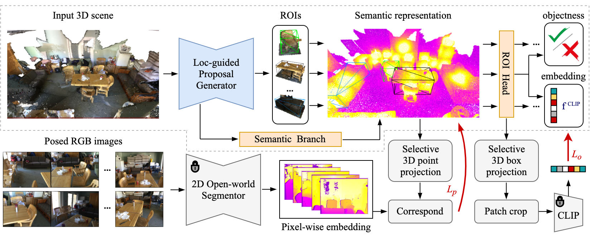

# TS3D: A Generalizable Open-vocabulary 3D Detector with Dual Path Distillation

This repo contains PyTorch implementation for TS3D based on [MMDetection3D](https://github.com/open-mmlab/mmdetection3d).

## Method
Overall pipeline of TS3D:

## Getting Started
For environment setup:
- [Installation](docs/installation.md) 

For dataset preparation:
- [Dataset preparation](data/README.md)

For training and evaluation:
- [Train and Eval](docs/run.md)

## Results
Visualization results on ScanNet:

Visualization results on ScanNet-25k:

